<div align="center">

# ReasonMotion: Language-Guided Editing and Reward-Guided Prediction for Sports Coaching

[](https://www.python.org/downloads/)
[](https://pytorch.org/)
[](https://lightning.ai/)
[](https://opensource.org/licenses/MIT)

</div>

---

## 📌 Abstract

Language-guided human motion modeling has advanced rapidly, but **sports coaching** poses a more demanding challenge: a practical coaching system must support **fine-grained technical edits** and predict how those edits affect downstream motion under biomechanical constraints. Existing human motion diffusion models rely heavily on supervised imitation learning, which limits localized controllability and adaptation toward higher-quality athletic outcomes.

**ReasonMotion** introduces a unified framework combining:

1. **Spatial-Temporal-Aware Mixture-of-Experts (ST-MoE)** architecture for precise instruction-grounded spatial/temporal decoupling.
2. **Visual Group Relative Policy Optimization (vis-GRPO)** to optimize continuous diffusion denoising trajectories toward domain-specific coaching objectives beyond pure imitation.

---

## 🎥 Video Demonstrations & Qualitative Results

We compare ReasonMotion against leading motion generation baselines under identical figure-skating jump takeoff prompts:

| Model | Video Render Link | Motion Characteristics |
| :--- | :--- | :--- |
| **Ground Truth (GT)** | 🎬 [`strobe_render_gt.mp4`](videos/cross_model_comparison/strobe_render_gt.mp4) 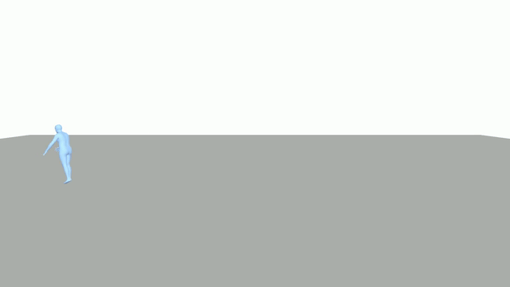 | Reference execution trajectory from professional skating athlete dataset. |
| **ReasonMotion (Ours)** | 🎬 [`strobe_render_ReasonMotion_rl.mp4`](videos/cross_model_comparison/strobe_render_ReasonMotion_rl.mp4) 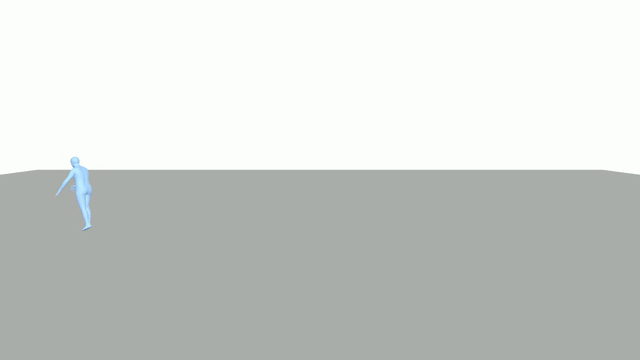 | **Optimal rotation speed & tuck form**, maintaining biomechanical alignment and high execution quality. |
| **CoMusion Baseline** | 🎬 [`strobe_render_CoMusion.mp4`](videos/cross_model_comparison/strobe_render_CoMusion.mp4) 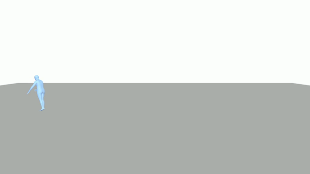 | Over-smooth trajectory; lacks fine-grained rotation acceleration during jump phase. |
| **TransFusion Baseline** | 🎬 [`strobe_render_TransFusion.mp4`](videos/cross_model_comparison/strobe_render_TransFusion.mp4) 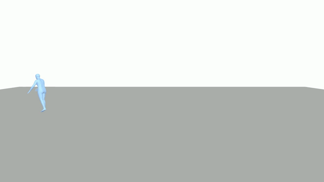 | High jitter near terminal frames with joint dislocation under rapid rotational momentum. |

### ❌ Failed Jump Case Study — 2F (Double Flip), Clip `2F_0015`

| Model | Video Render Link |
| :--- | :--- |
| **Ground Truth (GT)** | 🎬 [`vis_smpl_gt.mp4`](videos/gif/2F_0015_f/vis_smpl_gt.mp4) 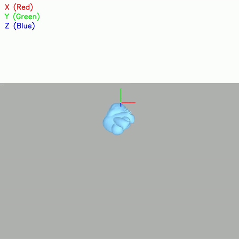 |
| **Original Video** | 🎬 [`res_2d_2F_0015.mp4`](videos/gif/2F_0015_f/res_2d_2F_0015.mp4) 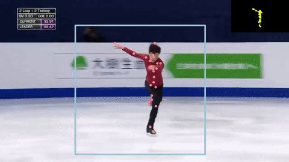 |
| **ReasonMotion (Ours)** | 🎬 [`vis_smpl_ReasonMotion_rl_5000batch.mp4`](videos/gif/2F_0015_f/vis_smpl_ReasonMotion_rl_5000batch.mp4) 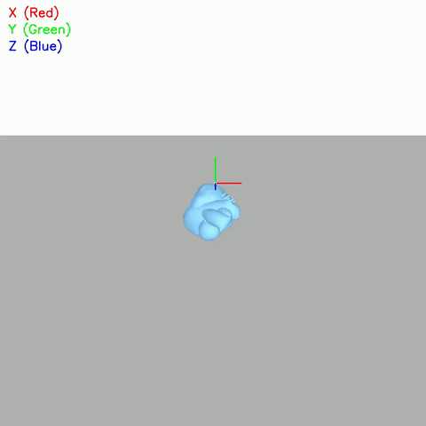 |
| **CoMusion Baseline** | 🎬 [`vis_smpl_CoMusion.mp4`](videos/gif/2F_0015_f/vis_smpl_CoMusion.mp4) 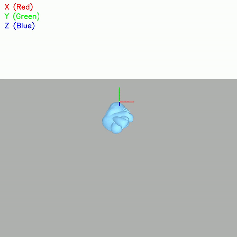 |
| **TransFusion Baseline** | 🎬 [`vis_smpl_TransFusion.mp4`](videos/gif/2F_0015_f/vis_smpl_TransFusion.mp4) 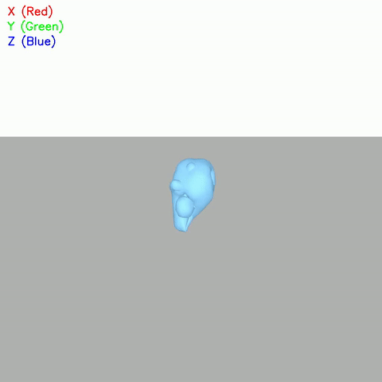 |

### ✅ Successful Jump Case Study — 3A (Triple Axel), Clip `3A_0040`

| Model | Video Render Link |
| :--- | :--- |
| **Ground Truth (GT)** | 🎬 [`vis_smpl_gt.mp4`](videos/gif/3A_0040_s/vis_smpl_gt.mp4) 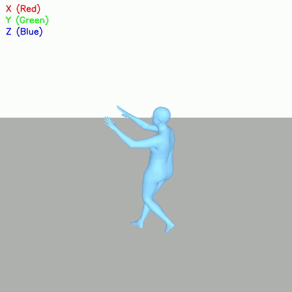 |
| **Original Video** | 🎬 [`res_2d_3A_0040.mp4`](videos/gif/3A_0040_s/res_2d_3A_0040.mp4) 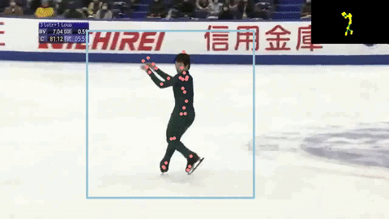 |
| **ReasonMotion (Ours)** | 🎬 [`vis_smpl_ReasonMotion_rl_5000batch.mp4`](videos/gif/3A_0040_s/vis_smpl_ReasonMotion_rl_5000batch.mp4) 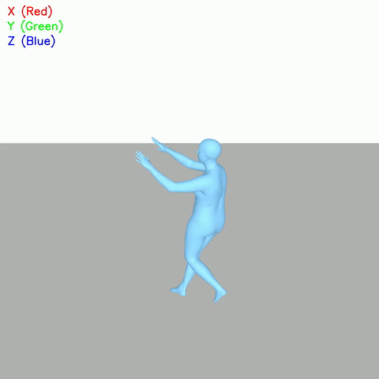 |
| **CoMusion Baseline** | 🎬 [`vis_smpl_CoMusion.mp4`](videos/gif/3A_0040_s/vis_smpl_CoMusion.mp4) 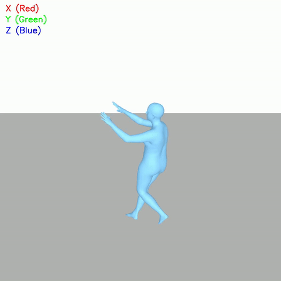 |
| **TransFusion Baseline** | 🎬 [`vis_smpl_TransFusion.mp4`](videos/gif/3A_0040_s/vis_smpl_TransFusion.mp4) 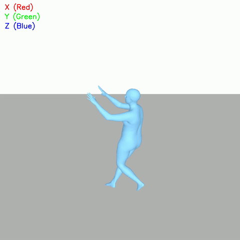 |

### Additional Demonstrations

| Demonstration | Video | Key Features |
| :--- | :--- | :--- |
| **Instruction-Grounded Motion Editing** | 🎬 [`motion_editing_exmple.mp4`](videos/motion_editing_exmple.mp4) 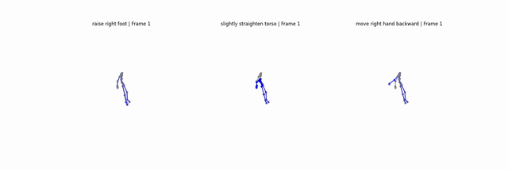 | Demonstrates fine-grained technical pose adjustments driven by language prompts while preserving biomechanical continuity. |
| **Boxing Coaching Adaptation** | 🎬 [`boxing_example.mp4`](videos/boxing_example.mp4) 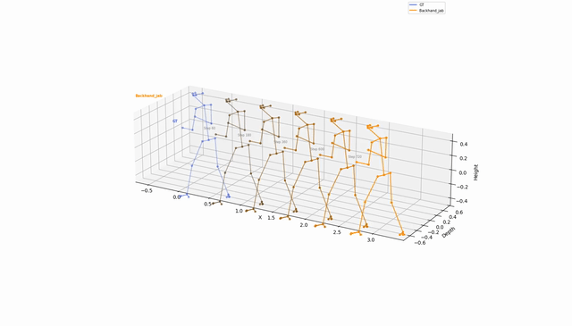 | Multi-view sports motion modeling showcasing upper-body dynamic strikes and balance preservation. |
| **Trajectory Overlap Analysis** | 🎬 [`overlap_rl_gt_3A_0057.mp4`](videos/cross_model_comparison/overlap_rl_gt_3A_0057.mp4) 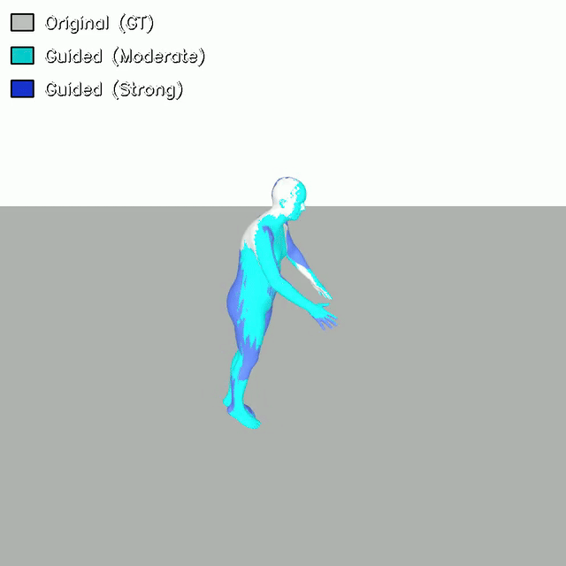 | Direct 3D skeleton overlap comparison between ReasonMotion RL predictions and Ground Truth (GT) jump takeoffs. |

---

## 🏗️ Framework Architecture

```text
                                  [ Language Instruction ]
                                             │ (AdaLN-Zero Injection)
[ Input Motion Trajectory x_t ] ──► [ Spatial-Temporal MoE ] ──► [ Decoupled Denoised Output ]
                                             │
                                    (vis-GRPO Trajectory RL)
                                             ▼
                               [ Group Relative Advantage ]
                                             │
                            [ Coaching Reward (GOE + Smoothness) ]
```

1. **Spatial-Temporal-Aware Mixture-of-Experts (ST-MoE)**
   - Separates body-part inter-joint relationships (spatial routing) from temporal momentum dynamics (temporal routing).
   - Prevents interference between posture control and trajectory smoothing.
2. **Visual Group Relative Policy Optimization (vis-GRPO)**
   - Treats the diffusion reverse process as a continuous policy.
   - Samples groups of denoising trajectories per prompt and computes relative advantage without needing a separate baseline critic network.
   - Incorporates domain-specific rewards (GOE athletic quality score, physical smoothness constraint, trajectory similarity).

---

## 📁 Repository Structure

```text
ReasonMotion/
├── configs/                       # Hydra configuration files
│   ├── dataset/                   # Dataset configs (FineFS, H3.6M, Boxing)
│   ├── model/                     # Model architectures (sft_baseline, flow_matching)
│   ├── train_sft.yaml             # Supervised fine-tuning config
│   └── train_rl.yaml              # vis-GRPO reinforcement learning config
├── data/                          # Data loaders and dataset wrappers
├── modules/                       # Core neural network modules (ST-MoE, Transformers)
├── systems/                       # PyTorch Lightning execution systems
│   ├── sft_system.py              # SFT training pipeline
│   └── grpo_system.py             # vis-GRPO RL training pipeline
├── scripts/                       # Evaluation & 3D skeleton rendering utilities
│   ├── evaluate.py                # Quantitative evaluation suite
│   ├── evaluate_hybrid.py         # Denoising relay ablation evaluator
│   ├── visualize.py               # 4-mode 3D skeleton video renderer
│   └── visualize_rl_diversity.py  # RL diversity sweep scanner
├── videos/                        # MP4 motion video demos for reviewers
│   └── cross_model_comparison/    # Comparative video renders
├── train.py                       # Main SFT entry point
└── train_rl.py                    # Main RL (vis-GRPO) entry point
```

---

## ⚙️ Installation & Environment Setup

```bash
# 1. Clone repository
git clone https://github.com/anonymous/ReasonMotion.git
cd ReasonMotion

# 2. Create Conda environment
conda create -n reasonmotion python=3.9 -y
conda activate reasonmotion

# 3. Install PyTorch (CUDA 11.8 / 12.1 compatible)
pip install torch torchvision torchaudio --index-url https://download.pytorch.org/whl/cu118

# 4. Install dependencies
pip install pytorch-lightning hydra-core omegaconf matplotlib scipy pandas tqdm
```

---

## 🚀 Quickstart Guide

### 1. Stage 1: Supervised Fine-Tuning (SFT)

Train the base ST-MoE diffusion backbone:

```bash
python train.py dataset=finefs
```

### 2. Stage 2: Reward-Guided RL Fine-Tuning (vis-GRPO)

Fine-tune the SFT model using vis-GRPO with coaching reward feedback:

```bash
python train_rl.py sft_dir=outputs/sft_finefs_<TIMESTAMP>
```

### 3. Quantitative Evaluation

Evaluate trained models on split test sets:

```bash
python scripts/evaluate.py --exp_dir outputs/rl_finefs_<TIMESTAMP> --nsample 5
```

### 4. 3D Skeleton Video Rendering

Generate a double-row prediction vs. ground truth comparison video:

```bash
python scripts/visualize.py \
  --exp_dir outputs/sft_finefs_<TIMESTAMP> \
  --mode infer \
  --motion ./data/FineFS_5s/3_final/valid/4F/4F_0011/new_res.pk
```
